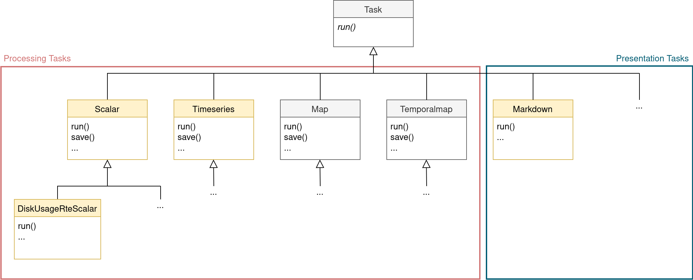

********************
Developer's Guide
********************

This part summarizes guidelines for extending the monitoring tool.

General Notes for Contributing
==============================

Use black_ and isort_ to format the code you add.

Code Structure
==============

All monitoring tasks are contained in the folder `monitoring`_.
`helpers`_ contains modules with functions and classes that are needed in multiple unrelated, processing and presentation tasks.

All monitoring tasks inherit from the generic `ScriptEngine Task`_.
Processing tasks have an inheritance substructure defined by their diagnostic type.
New processing tasks should adhere to these structure: 
Either inherit from the corresponding Diagnostictype class (Scalar, Timeseries, Map, Temporalmap) or create a new one if it is a new diagnostic type.
The Diagnostictype class provides a ``save()`` method that can be reused by all inherited tasks.
This structure is illustrated below:

To make a task accessible to users, add it as an entry point to `setup.py`_.

Logging Policy
==============

Every (monitoring) task is responsible for logging its execution.
In the beginning of ``self.run()`` (after *very few* lines of code), a task **must** call ``self.log_info()`` to log that it is active.
It may include information about its arguments in the log message, but nothing that would require a lot of code processing the arguments (which could fail).
A task **should** write only one ``log_info`` message during execution.
General "progression" statements **must** be ``log_debug`` messages.
If a monitoring task experiences an unrecoverable error: It **must** use ``log_error`` and throw one of the `ScriptEngine Task Exceptions`_.
For problems which do not lead to a ``ScriptEngineTaskException``, use ``log_warning`` instead.

.. _naming-scheme:

Naming Processing Tasks
=======================

A processing task has a name that appears in multiple places:

    - the Python class
    - the Python module
    - the YAML representation
    - the diagnostics on disk created by it

These all adhere to the same naming scheme: ``variable_component_[domain_op_...]_diagnostictype``.
The Python class uses the name in CamelCase naming convention.
YAML representation, module, and diagnostic on disk use the snake\_case naming convention (see the usage example).

.. csv-table::
   :file: ./naming_scheme.csv
   :widths: 20, 20, 20, 20, 20, 20

*Italic keywords* can be used as placeholders for the keywords they describe.
If a user can select the operation of the domain, use *op* as a placeholder.

The ``domain_op`` combination can be used consecutively, e.g.: ``global_sum_month_max_year_mean``.
The variable keyword is less standardized, e.g. amocstrength, sypd, tos, 2t, 167,...
Depending on the diagnostic/processing task, parts of the naming scheme are unnecessary.
``diagnostictype`` may not be omitted.

Usage Example: Naming Scheme
#############################

    - Python class: ``NemoGlobalMeanYearMeanTimeseries``
    - Python module: ``nemo_global_mean_year_mean_timeseries``
    - YAML representation: ``ece.nemo_global_mean_year_mean_timeseries``
    - the diagnostics on disk created by it: ``ece.mon.tos_nemo_global_mean_year_mean_timeseries.nc``

Naming Presentation Tasks
=========================

Naming presentation tasks is not as standardized as for processing tasks.
The task/class/module name should be the presentation outlet, e.g. Markdown.
Their YAML representation is preceded by *ece.mon.presentation* to make them distinguishable from processing tasks.

.. _`black`: https://black.readthedocs.io/en/stable/
.. _`isort`: https://pycqa.github.io/isort/
.. _`monitoring`: https://github.com/uwefladrich/scriptengine-tasks-ecearth/tree/master/monitoring
.. _`helpers`: https://github.com/uwefladrich/scriptengine-tasks-ecearth/tree/master/helpers
.. _`ScriptEngine Task`: https://github.com/uwefladrich/scriptengine/blob/master/scriptengine/tasks/core/task.py
.. _`setup.py`: https://github.com/uwefladrich/scriptengine-tasks-ecearth/tree/master/setup.py
.. _`ScriptEngine Task Exceptions`: https://github.com/uwefladrich/scriptengine/blob/master/scriptengine/exceptions.py
